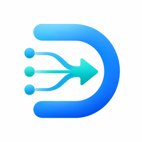
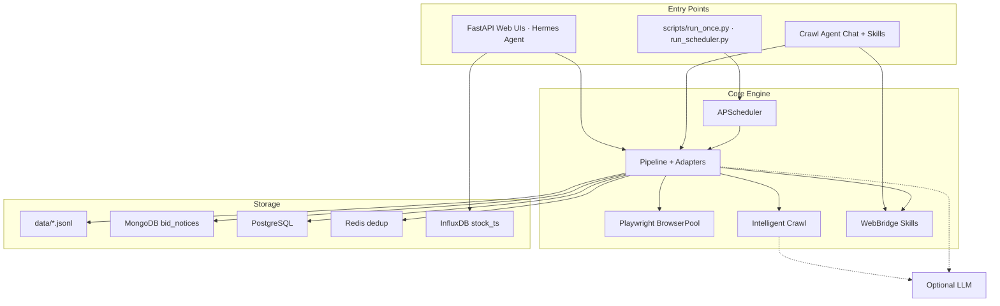

<a id="top"></a>

<div align="center">

<p align="center">
  
</p>

[](https://www.python.org/downloads/)
[](docs/README.full.md)
[](README.md)
[](README.en.md)

**English** | [简体中文](README.md)

</div>

---

## What is WebScraperAgent?

**WebScraperAgent** is an open-source, AI-assisted web scraping platform for procurement notices, WeChat official-account articles, and domain-specific insight dashboards. It ships with **151 pre-configured sites** (49 enabled out of the box), YAML crawl rules, Playwright automation, and optional LLM enrichment — so teams get **insights**, not just raw dumps.

Procurement notices, policy updates, and industry signals are scattered across national platforms, provincial GGZY portals, SOE procurement systems, and WeChat accounts. Manual monitoring is slow; brittle one-off scripts break on every layout change. WebScraperAgent combines a rule engine, Chrome recorder, WebBridge real-browser fallback, and the **Hermes conversational crawl agent** to keep coverage maintainable at scale.

| | Traditional scripts | WebScraperAgent |
|---|---------------------|-------------------|
| **Site coverage** | One script per site | **151** sites, YAML rules + adapters |
| **Maintenance** | Breaks on DOM changes | Rule engine + recorder + WebBridge |
| **Interaction** | Edit code for every task | **Hermes Agent** — chat-driven crawl with Skills |
| **Output** | Flat files | **Domain dashboards** — Business Opportunity Insights, Stock Insights |
| **Operations** | Ad-hoc cron | APScheduler + Web UI sync + layered storage |

> **Tagline:** *Stop chasing scattered bid notices — let an AI Agent crawl, schedule, and turn raw data into actionable insights.*

**Example: quick start**

```bash
git clone <your-repo-url> web_scraper_agent
cd web_scraper_agent
python3 -m venv .venv && source .venv/bin/activate
bash scripts/install.sh
cp .env.example .env   # set OPENAI_API_KEY if using LLM features
make start             # MongoDB + InfluxDB + main UI 8090 (incl. insights) + stock 8092 + scheduler
make status            # port & HTTP health checks
```

Open **http://127.0.0.1:8090/insights** (Business Opportunity Insights) and **http://127.0.0.1:8092/** (Stock Insights).

**Example: crawl a single site**

```bash
source .venv/bin/activate
bash scripts/run_with_local_chrome.sh \
  python scripts/run_once.py ccgp_national --max-items 5
```

**Example: run the scheduler**

```bash
python scripts/run_scheduler.py
```

> **Disclaimer:** Stock insights and investment-plan outputs are for research and demonstration only — **not financial advice**.

---

## Key Features

- **Out of the box** — `make start` launches main UI (8090, incl. insights), Stock Insights (8092), scheduler, MongoDB, and InfluxDB
- **151+ sites, 49 enabled** — National procurement, provincial portals, SOE platforms, industry sources, WeChat articles
- **Agent-driven crawl** — Hermes conversational agent + intelligent BFS discovery + optional LLM enrichment
- **Real-browser automation** — Playwright headless pool + WebBridge extension for login-heavy or anti-bot sites
- **Insight dashboards** — Digital agriculture and other keyword-based opportunity filtering, stock sector analysis, daily briefs
- **Scheduled sync** — Cron & interval jobs for opportunity insights SOE sync, stock news/policy feeds, per-site round-robin crawls
- **Multi-channel notifications** — Feishu, DingTalk, WeCom, email, SMS via scheduled tasks
- **Layered storage** — JSONL → MongoDB → PostgreSQL, with Redis dedup and InfluxDB for stock K-lines

---

## Architecture



See [`docs/DESIGN.md`](docs/DESIGN.md) and [`docs/HERMES_CRAWL_AGENT.md`](docs/HERMES_CRAWL_AGENT.md) for deeper design notes.

| Service | Port | Description |
|---------|------|-------------|
| Main Web UI | 8090 | Notice list, sync panel, crawl rules, Hermes chat, **Business Opportunity Insights** (`/insights`) |
| Opportunity Insights (standalone, optional) | 8091 | Deprecated for main flow; `agri_app.py` kept for standalone deploy |
| Stock Insights | 8092 | A-share/HK/US market data, news, policy sync, sector analysis |
| Hermes Crawl Agent | 8095 | Standalone agent UI for conversational crawl tasks |

---

## How to use it

* **[Full Documentation](docs/README.full.md)** — Extended setup, storage, MongoDB, intelligent crawl
* **[Quick Start](#what-is-webscrapaperagent)** — Install, configure `.env`, `make start` (above)
* **[Configuration](docs/README.full.md)** — `.env` variables (`MONGODB_URI`, `OPENAI_API_KEY`, …), `config/sites.yaml`, `config/schedule.yaml`
* **[Notification Channels](docs/README.full.md)** — global `.env` for Feishu/DingTalk/WeChat/SMTP/SMS; per-task overrides via `channel_config` in the scheduled task dialog
* **[Business Opportunity Insights](docs/README.full.md)** — SOE sync, digital agri keyword filtering, port 8090 `/insights` dashboard
* **[Stock Insights](docs/README.full.md)** — AKShare quotes, policy feeds, sector analysis on port 8092
* **[Hermes Crawl Agent](docs/HERMES_CRAWL_AGENT.md)** — Conversational crawl with Skills & tool calling
* **[WebBridge Crawl](skills/webbridge-crawl/SKILL.md)** — Real-browser automation playbook
* **[Docker Deployment](docker/README.md)** — Container deployment notes
* **[Contributing](#contributing)** — PR workflow; run `bash scripts/ci.sh` before submitting

### Makefile shortcuts

```bash
make help          # all targets
make start         # default stack (8090 + 8092 + scheduler + DBs; 8091 standalone UI optional)
make stop          # stop UI and scheduler
make restart-agri  # restart opportunity insights UI
make restart-stock # restart stock UI
make docker-up     # Docker Compose up
```

---

## Support the Project

If this project helps you, consider supporting ongoing development:

<table>
  <tr>
    <td align="center">
      <br/>
      <b>Thanks for the coffee</b><br/>
      <sub>WeChat Reward · 微信赞赏</sub>
    </td>
  </tr>
</table>

You can also **star the repo** or **open issues** to help improve the project.

---

## More

* **Report issues** — GitHub / Gitee issue tracker *(add repo URL before public release)*
* **简体中文 README** — [README.md](README.md)
* **Contact** — Email *(to be added)*
* **CI** — GitHub Actions workflow at [`.github/workflows/ci.yml`](.github/workflows/ci.yml); local run: `bash scripts/ci.sh`

---

## Contributing

Contributions are welcome! Fork the repository, keep changes focused, and run `bash scripts/ci.sh` before submitting a PR. Do **not** commit secrets (`.env`, API keys, tokens). For large features (new adapters, Skills, dashboards), open an issue first.

---

## License

This project does not yet include a root `LICENSE` file. Please confirm the intended license (e.g. MIT, Apache-2.0) before public release.
