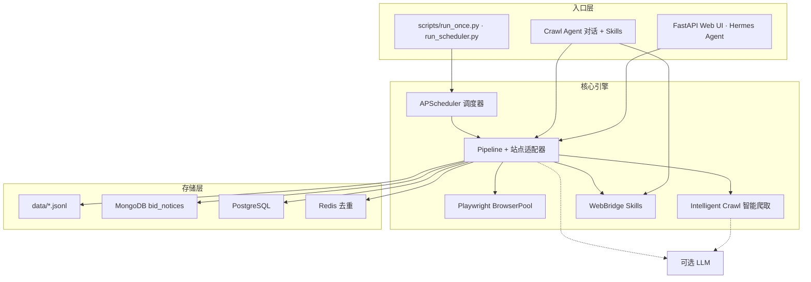

<a id="top"></a>

<div align="center">

<p align="center">
  
</p>

[](https://www.python.org/downloads/)
[](docs/README.full.md)
[](README.md)
[](README.en.md)

[English](README.en.md) | **简体中文**

</div>

---

## 什么是 WebScraperAgent？

**WebScraperAgent** 是一款面向招标采购公告、微信公众号文章与领域洞察场景的开源 **AI 辅助 Web 爬虫平台**。内置 **151 个预配置站点**（开箱启用 49 个）、YAML 爬取规则、Playwright 自动化与可选 LLM 增强，帮助团队获得**可行动的洞察**，而不只是原始数据堆砌。

招标公告、政策动态与行业信号分散在国家级平台、省级政采/公共资源、央企采购与微信公众号中。人工逐站盯盘成本高，传统脚本一改版就挂。本项目以规则引擎、Chrome 录制扩展、WebBridge 真实浏览器兜底，以及 **Hermes 对话式爬取 Agent**，让大规模站点覆盖可持续维护。

| | 传统方式 | WebScraperAgent |
|---|----------|-------------------|
| **站点覆盖** | 每个站一套脚本 | **151** 个站点，YAML 规则 + 专用适配器 |
| **维护成本** | 页面改版即失效 | 规则引擎 + 录制扩展 + WebBridge |
| **使用方式** | 改代码才能爬新任务 | **Hermes Agent** 对话式爬取，Skills + 工具调用 |
| **产出形态** | 扁平文件 | **领域专题仪表盘** — 行业洞察 |
| **运维** | 零散 cron | APScheduler + Web UI 同步面板 + 分层存储 |

> **Slogan：** *告别分散盯盘与脆弱脚本 —— 用 AI Agent 自动爬取、定时同步，把海量公告变成可行动的洞察。*

**示例：快速开始**

```bash
git clone <your-repo-url> web_scraper_agent
cd web_scraper_agent
python3 -m venv .venv && source .venv/bin/activate
bash scripts/install.sh
cp .env.example .env   # 使用 LLM 时需配置 OPENAI_API_KEY
make start             # MongoDB + 主站 8090（含行业洞察）+ 调度器
make status            # 端口与 HTTP 健康检查
```

打开 **http://127.0.0.1:8090/insights**（行业洞察）；热力专页 **http://127.0.0.1:8090/insights/industry-heatmap**。

**行业配置 SOP（标准作业流程）**

在 `/insights/sop` 按五步向导完成领域行业配置：选择领域 → 生成关键词 → 匹配站点 → 创建定时爬取 → 配置飞书总结推送。完成后自动更新 `config/biz_clue_sources.yaml` 并创建通知任务。

**示例：单站爬取**

```bash
source .venv/bin/activate
bash scripts/run_with_local_chrome.sh \
  python scripts/run_once.py ccgp_national --max-items 5
```

**示例：启动调度器**

```bash
python scripts/run_scheduler.py
```

---

## 核心特性

- **开箱即用** — `make start` 一键启动主站（8090，含商机洞察）、调度器与 MongoDB
- **151+ 站点，49 条已启用** — 覆盖国家级政采、省级门户、央企平台、行业源与微信公众号
- **Agent 驱动爬取** — Hermes 对话 Agent + 智能 BFS 发现 + 可选 LLM 增强
- **自然语言创建任务** — 在 `/hermes` 用对话描述站点、关键词与频率，自动创建爬取与通知任务
- **真实浏览器自动化** — Playwright 无头池 + WebBridge 扩展，应对登录态与反爬场景
- **专题洞察** — 数字农业等关键词商机过滤、LLM 每日简报
- **商机配置 SOP** — `/insights/sop` 向导式配置：领域模板 → 关键词 → 站点匹配 → 定时爬取 → 推送
- **定时同步** — 商机洞察央企同步、站点轮询等 cron 任务
- **多渠道通知** — 飞书、钉钉、企业微信、邮件、短信（通过定时任务配置）
- **分层持久化** — JSONL → MongoDB → PostgreSQL，Redis 去重

---

## 自然语言创建爬虫任务

通过 **Hermes 对话 Agent**（[http://127.0.0.1:8090/hermes](http://127.0.0.1:8090/hermes)）用中文或英文描述爬取需求，系统自动解析意图并创建增量同步、定时通知等任务，无需手写脚本或改 YAML。

**示例对话**

- 「每天上午 9 点爬取 ccgp 国家平台数字农业相关公告并推送到飞书」
- 「帮我对已启用的央企采购站做增量同步」
- 「查看已配置的通知任务」

**Agent 能力**

- 口语化站点名 → `site_id` 解析；新站可对话内注册并生成爬取规则
- Skills + 工具调用：WebBridge 真实浏览器、`run_once`、增量 sync、站点诊断
- 对话内创建 cron 定时任务，持久化至[通知任务页](/tasks)（飞书、钉钉、企业微信等）

**与商机 SOP 的区别**

| | Hermes 对话 | 商机 SOP（[`/insights/sop`](/insights/sop)） |
|---|-------------|---------------------------------------------|
| 场景 | 即时描述、一次性或临时任务 | 领域商机配置向导（五步模板） |
| 产出 | 爬取执行、增量 sync、通知任务 | `biz_clue_sources.yaml` + 专题洞察流水线 |

**前置条件**

- `.env` 配置 `HERMES_AGENT_CHAT_URL`（默认 `http://127.0.0.1:8642`）、`HERMES_AGENT_API_KEY`（与 hermes-agent `API_SERVER_KEY` 一致）
- Hermes Gateway / API Server 已运行（调度 crawl dispatch `:8080`，对话 `/v1/runs` `:8642`）；可用 `docker compose up hermes-agent` 或 `make start-hermes-agent`
- 主站 `make start` 后访问 `/hermes`；独立 UI 亦可使用 `8095/hermes`

详见 [`docs/HERMES_CRAWL_AGENT.md`](docs/HERMES_CRAWL_AGENT.md)。

---

## 架构概览



详细设计见 [`docs/DESIGN.md`](docs/DESIGN.md)、[`docs/HERMES_CRAWL_AGENT.md`](docs/HERMES_CRAWL_AGENT.md)、[`docs/design/industry-insights-supply-chain.md`](docs/design/industry-insights-supply-chain.md)（行业洞察与全球供应链）。

| 服务 | 端口 | 说明 |
|------|------|------|
| 主 Web UI | 8090 | 数据列表、同步面板、爬取规则、Hermes 对话（/hermes）、**商机洞察**（/insights）、**行业洞察**（/insights/industry-heatmap 等） |
| 商机洞察（独立，可选） | 8091 | 已弃用为主流程；保留 `agri_app.py` 供独立部署 |
| Hermes Gateway / API | 8080 / 8642 | crawl dispatch 与对话 `/v1/runs`；`/hermes` 依赖 8642 已就绪 |
| Hermes 爬取 Agent（独立 UI） | 8095 | 独立 Agent 对话界面，自然语言驱动爬取 |

---

## 如何使用

* **[完整文档](docs/README.full.md)** — 安装、存储、MongoDB、智能爬取等详细说明
* **[快速开始](#什么是-webscrapaperagent)** — 安装、配置 `.env`、`make start`（见上方示例）
* **[配置说明](docs/README.full.md)** — `.env` 变量（`MONGODB_URI`、`OPENAI_API_KEY` 等）、`config/sites.yaml`、`config/schedule.yaml`
* **[通知渠道](docs/README.full.md)** — 在 `.env` 配置飞书/钉钉/企业微信/SMTP/短信全局参数；在通知任务对话框中按渠道填写任务级 `channel_config` 覆盖
* **[商机洞察](docs/README.full.md)** — 七大央企同步、数字农业关键词过滤、8090 `/insights` 仪表盘
* **[Hermes 爬取 Agent](docs/HERMES_CRAWL_AGENT.md)** — 对话式爬取与 Skills 技能包
* **[WebBridge 爬取](skills/webbridge-crawl/SKILL.md)** — 真实浏览器自动化剧本
* **[Docker 部署](docker/README.md)** — 容器部署说明
* **[贡献指南](#贡献指南)** — PR 流程；提交前运行 `bash scripts/ci.sh`

### Makefile 常用命令

```bash
make help          # 查看所有目标
make start         # 默认全栈（8090 + 调度器 + 数据库；8091 独立 UI 可选）
make stop          # 停止 UI 与调度器
make restart-agri  # 重启商机洞察 UI
make docker-up     # Docker Compose 启动
```

---

## 支持项目

如果本项目对你有帮助，欢迎通过以下方式支持持续开发：

<table>
  <tr>
    <td align="center">
      <br/>
      <b>感谢你的咖啡</b><br/>
      <sub>微信赞赏 · WeChat Reward</sub>
    </td>
  </tr>
</table>

你也可以在 GitHub / Gitee **Star 本仓库**，或通过 **Issue** 反馈问题与建议。

---

## 更多

* **反馈问题** — GitHub / Gitee Issue 跟踪 *(公开发布前请补充仓库地址)*
* **English README** — [README.en.md](README.en.md)
* **联系方式** — 邮箱 *（待补充）*
* **CI** — GitHub Actions 工作流见 [`.github/workflows/ci.yml`](.github/workflows/ci.yml)；本地运行：`bash scripts/ci.sh`

---

## 贡献指南

欢迎贡献！Fork 仓库、保持改动聚焦，提交 PR 前运行 `bash scripts/ci.sh`。**切勿**提交密钥（`.env`、API Key、Token 等）。较大功能（新适配器、Skills、仪表盘）建议先开 Issue 讨论范围。

---

## 开源协议

项目根目录尚未包含 `LICENSE` 文件。公开发布前请确认开源协议类型（如 MIT、Apache-2.0）。
# 世舶招投标 API

服务端已提供 `/api/gov-bid/*` 代理接口。请仅在本地 `.env` 配置
`GOV_BID_API_KEY`；可选配置 `GOV_BID_BASE_URL`，默认使用
`https://gate.gov-bid.com/outer-gateway`。请求示例和端点清单见
`docs/gov_bid_api.md`。
