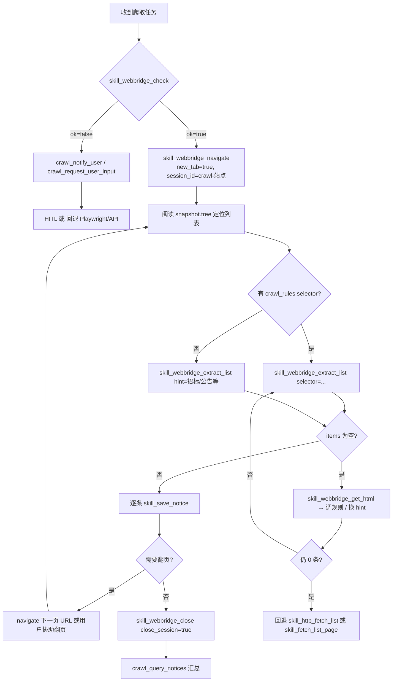

# WebBridge Crawl — 真实浏览器优先爬取

Hermes 对话 Agent（Web UI `/hermes`）收到爬取任务时，**先** `skill_webbridge_check`；可用则通过 **Kimi WebBridge** 控制用户本机**已登录** Chrome/Edge 抓取。**Playwright**（`skill_fetch_list_page` 等）与 **纯 HTTP API**（`skill_http_fetch_list`）为**回退**，仅在 WebBridge 不可用或抓取失败时使用。定时增量（APScheduler + RuleExecutor）仍走服务端 Playwright，不受本 SOP 影响。

## 0. 新爬虫默认流程（无 crawl_rules 时）

用户说「帮我爬取 XXX 网站」且站点为 **generic / 无有效 list_page / 占位规则** 时：

```
crawl_resolve_site
  → skill_webbridge_check
  → skill_webbridge_navigate(entry_url, new_tab=true)
  → skill_analyze_list_dom(session_id=…)     # page_hints
  → crawl_generate_rule(page_hints=…)
  → crawl_validate_rule → crawl_save_rule
  → crawl_test(max_pages=1)
  → crawl_enable_site（试跑通过）
  → 再执行分步爬取（本 skill §3 决策树）
```

**不要**在无规则时直接 `skill_fetch_list_page` 或写一次性脚本。规则生成细节见 [crawl-rule-generation](../crawl-rule-generation/SKILL.md)。

**例外**：微信公众号（chain-only 脚本）、BIM 专用 HTTP cron、用户明确要求「只用 API/HTTP/Playwright」。

**相关文档**：[crawl-path SOP](../crawl-path/SKILL.md) · [HERMES_CRAWL_AGENT §11](../../docs/HERMES_CRAWL_AGENT.md#11-web-ui-对话hermes-爬虫运维) · 底层实现 `src/web/webbridge_skills.py`

### 运行时模式（必读）

**默认栈为本地 screen**，非 Docker 容器：

| 组件 | 启动 | 地址 |
|------|------|------|
| web_scraper API | `make start-ui` 或 `make start` | `http://127.0.0.1:8090` |
| hermes-agent Gateway | `make start-hermes-agent` 或 `make start` | dispatch `:8080`，API `:8642` |
| Kimi WebBridge daemon | `~/.kimi-webbridge/bin/kimi-webbridge start` | `http://127.0.0.1:10086` |

hermes-agent 环境变量 **`WEB_SCRAPER_BASE_URL=http://127.0.0.1:8090`**（勿用 `host.docker.internal`）。Agent 收到 WebBridge 任务时，**先调用 `skill_webbridge_check`**；若返回 `running: true` 且 `extension_connected: true` 则继续，**不要**因「容器网络不可达」放弃 WebBridge。

---

## 1. 什么是 Kimi WebBridge

Kimi WebBridge 是一套**本机浏览器自动化**方案：在用户电脑上运行轻量 **daemon**（默认 `http://127.0.0.1:10086`），通过 **浏览器扩展** WebSocket 连接，让 AI 能操作用户**真实浏览器**中的标签页。

### 1.1 与 Playwright 的区别

| 维度 | Kimi WebBridge（Hermes 对话**首选**） | Playwright / API（**回退**） |
|------|--------------------------------------|------------------------------|
| 浏览器 | 用户本机 Chrome/Edge | 服务端 headless Chromium 或零 browser HTTP |
| 登录态 | **复用用户已登录会话** | 需 Cookie / credentials 或纯 REST |
| 部署 | 需本机 daemon + 扩展 | web_scraper 进程内即可 |
| 反爬 | 更像真人浏览（同用户 UA、IP、Cookie） | 易被识别为自动化 / IP 封 |
| SPA / 重 JS | 真实渲染，适合复杂前端 | RuleExecutor / HTTP API |

### 1.2 适用场景

在 **Hermes /hermes 对话**中，WebBridge 为**默认首选**（收到爬取任务即 `skill_webbridge_check`），尤其适用于：

- **登录墙 / SSO**：复用用户已登录浏览器
- **反爬**：验证码、WAF、IP 限制、headless 检测
- **DOM / SPA**：用户浏览器所见即抓取目标
- **电建等 API 站**：用户未特别声明「只用 API」时仍**先 WebBridge**；check 失败或 0 条时再回退 `skill_http_fetch_list` 并说明原因
- **用户明确要求**：「用我打开的浏览器」「在我已登录的页面上抓」

### 1.3 不适用场景

- **CI / 远程服务器**：无用户浏览器，daemon 通常不可用
- **严格 `isTrusted` 检测**：部分银行门户、验证码拒绝合成 click/fill
- **跨域 iframe 内元素**：需直接 navigate 到 iframe URL
- **批量无人值守 happy path**：日常增量仍由 APScheduler + Playwright 承担

---

## 2. 安装与启动

### 2.1 一键安装

```bash
curl -fsSL https://kimi-web-img.moonshot.cn/webbridge/install.sh | bash
```

安装脚本会：

1. 将 CLI 安装到 `~/.kimi-webbridge/bin/kimi-webbridge`
2. 默认启动 daemon（监听 `:10086`）
3. 向已检测到的 AI Agent 安装 kimi-webbridge skill

**install.sh 可选参数**：

| 参数 | 说明 |
|------|------|
| `--no-start` | 只安装二进制，不启动 daemon |
| `--no-skill` | 只安装并启动 daemon，跳过 skill 安装 |
| `-h` / `--help` | 显示用法 |

### 2.2 日常命令

```bash
# 健康检查（Agent 第一步必做）
~/.kimi-webbridge/bin/kimi-webbridge status

# 启动 / 停止 / 重启（start 幂等，已运行可重复执行）
~/.kimi-webbridge/bin/kimi-webbridge start
~/.kimi-webbridge/bin/kimi-webbridge stop
~/.kimi-webbridge/bin/kimi-webbridge restart

# 日志
~/.kimi-webbridge/bin/kimi-webbridge logs -n 100
~/.kimi-webbridge/bin/kimi-webbridge logs -f
```

**status 正常输出示例**：

```json
{
  "running": true,
  "extension_connected": true,
  "port": 10086,
  "version": "x.y.z",
  "extension_version": "x.y.z"
}
```

### 2.3 浏览器扩展

1. 安装扩展：[https://kimi.com/features/webbridge](https://kimi.com/features/webbridge)（中文：[zh-cn 页面](https://www.kimi.com/zh-cn/features/webbridge)）
2. 打开 Chrome/Edge，确保扩展已启用
3. 再次执行 `status`，确认 `extension_connected: true`

若 daemon 报 **"Please update the Kimi WebBridge extension"**，提示用户更新扩展后**勿重试**同一命令。

### 2.4 环境变量（可选）

| 变量 | 默认 | 说明 |
|------|------|------|
| `KIMI_WEBBRIDGE_URL` | `http://127.0.0.1:10086` | daemon 地址（`webbridge_skills.py` 读取） |

### 2.5 常见问题速查

| 现象 | 处理 |
|------|------|
| `command not found` | 未安装 → 执行 install.sh |
| `running: false` | `kimi-webbridge start` |
| `extension_connected: false` | 打开浏览器并启用扩展；已安装则刷新扩展连接 |
| `address already in use` | `stop` 后 `start`；或 `lsof -i :10086` 查占用进程 |
| 工具调用超时 | `kimi-webbridge logs -n 100` 查 `[error]` |

---

## 3. 与 Crawl Agent 的关系

Hermes 对话 Agent **首选 WebBridge**（`skill_webbridge_*`），由 `src/web/webbridge_skills.py` 封装 daemon HTTP，经 `CrawlAgentToolExecutor` 暴露。**回退**为 Playwright `BrowserPool` + `RuleExecutor` 或纯 HTTP API（见 [crawl-path](../crawl-path/SKILL.md)）。

```
收到爬取任务
        ↓
skill_webbridge_check
        ├─ ok=true  → navigate → extract_list → skill_save_notice → close
        └─ ok=false → HITL / 回退 Playwright 或 skill_http_fetch_list
```

### 3.1 五个工具一览

| Tool | 参数 | 返回值（`ok: true` 时） | 何时调用 |
|------|------|-------------------------|----------|
| `skill_webbridge_check` | 无 | `running`, `extension_connected`, `version`, `daemon_url`；失败含 `install_hint` | **爬取任务第一步**；确认本机 WebBridge 可用 |
| `skill_webbridge_navigate` | `url`（必填）, `session_id?`, `new_tab?`（默认 true）, `group_title?` | `url`, `title`, `tab_id`, `session_id`, `snapshot: {tree, truncated, char_count}` | 打开列表页；首次务必 `new_tab: true` |
| `skill_webbridge_extract_list` | `selector?`, `hint?`（至少其一）, `session_id?`, `max_items?`（默认 50，最大 200） | `items[{title,url}]`, `item_count` | navigate 之后；有 crawl_rules selector 优先传 `selector`，否则用 `hint` 过滤 |
| `skill_webbridge_get_html` | `session_id?`, `max_chars?`（默认 50000） | `html`（截断）, `html_length`, `truncated` | selector 不确定、规则调试；配合 `crawl_generate_rule` |
| `skill_webbridge_close` | `session_id?`, `close_session?`（默认 false） | `closed`, `action`（`close_tab` / `close_session`） | **任务结束必调**；`close_session: true` 释放整组标签 |

**失败响应共性**：`ok: false` + `error`；不可用时附带 `install_hint`；扩展过旧时含 `extension_update_url`。

### 3.2 与主路径 skill 的配合

| 主路径 Tool | WebBridge 场景下的角色 |
|-------------|------------------------|
| `skill_fetch_list_page` | WebBridge 不可用/失败时的 **Playwright 回退**；**不**与 webbridge 并行重复抓同一页 |
| `skill_save_notice` | **不变** — webbridge 提取的 `{title,url}` 仍走 Pipeline 去重入库 |
| `skill_fetch_detail_page` | WebBridge 当前**无**专用详情工具；详情仍尝试主路径，或 HITL |
| `skill_close_session` | 关闭 **Playwright** BrowserPool；与 `skill_webbridge_close` **独立**，各关各的 |

### 3.3 实现映射

| 层 | 路径 |
|----|------|
| daemon 封装 | `src/web/webbridge_skills.py` |
| Tool schema + 执行 | `src/web/crawl_agent_tools.py` → `WEBBRIDGE_TOOL_SCHEMAS` |
| 对话系统提示 | `src/web/crawl_agent_chat_service.py` |
| Hermes 薄封装 | `hermes-agent/tools/crawl_tools.py` → `POST /api/crawl-agent/skills/execute` |

---

## 4. Agent SOP 决策树

### 4.1 何时优先 WebBridge、何时回退

**Hermes 对话收到爬取任务** → **始终先** `skill_webbridge_check`：

```
收到爬取任务（任意站点，含电建等 API 站，除非用户明确「只用 API/HTTP」）
    ↓
skill_webbridge_check
    ├─ ok=true → skill_webbridge_navigate → extract_list → save → close
    └─ ok=false → graceful degrade（见下）
```

**WebBridge check 失败或抓取 0 条/超时/403 时**，再回退（向用户说明原因）：

```
    ├─ list_page.strategy=api → skill_http_fetch_list（零 browser）
    ├─ DOM 站 → skill_fetch_list_page / skill_paginate（Playwright）
    └─ 仍失败 → HITL（crawl_request_user_input / crawl_notify_user）
```

**不要**：

- WebBridge `check` 失败时 crash 或死循环重试 → 改走 HITL 或 Playwright/API 回退
- `completed` 且 `new_count=0` 但列表抓取正常（可能是增量无新公告，见 HERMES §6.5.3）

### 4.2 标准流程（mermaid）



### 4.3 逐步说明

1. **`skill_webbridge_check`** — `running` 且 `extension_connected` 均为 true 才继续；否则 **graceful degrade**（`crawl_notify_user` 发安装指引，或 `crawl_request_user_input(login_cookie)`），**禁止**让 Agent crash。

2. **`skill_webbridge_navigate`**
   - `url`：列表入口（来自 `skill_plan_crawl_path` 的 `entry_urls` 或失败时的 `list_url`）
   - `new_tab: true`（首次打开）
   - `session_id`：建议 `crawl-{site_id}`（见 §7）
   - `group_title`：可选，浏览器标签组显示名（如「爬取-铁建物资」）
   - 阅读返回的 `snapshot.tree`（截断至约 6000 字符）理解页面结构

3. **`skill_webbridge_extract_list`**
   - 有 YAML `list_item` / `list_link` selector → 传 `selector`
   - 无规则 → 传 `hint`（如「招标」「采购」「公告」）过滤 `<a>` 文本与 href
   - `selector` 与 `hint` **至少提供一个**

4. **`skill_save_notice`** — 对每条 `{title, url}` 调用，参数与主路径相同（`site_id`, `title`, `url`, 可选 `publish_date` 等）

5. **翻页（可选）**
   - 从 `snapshot.tree` 找「下一页」链接或页码 URL
   - 对下一页 URL 再次 `skill_webbridge_navigate`（同 `session_id`，`new_tab: false` 可在当前 tab 导航）
   - **SPA 无 URL 变化时**：用 `skill_webbridge_evaluate` 点击分页元素（如 Ant Design 页码），等 2-3 秒后重新提取
   - 重复 extract → save
   - **注意**：SPA 分页可能出现数据重叠（pages 2+ 重复 page 1 的数据），`skill_save_notice` 的去重机制可以自动处理

6. **`skill_webbridge_close`** — `close_session: true`，释放该 session 下全部标签

### 4.4 规则调试分支

selector 不确定或 extract 返回 0 条时：

```
skill_webbridge_navigate
  → skill_webbridge_get_html(max_chars=30000)
  → 分析 HTML 结构
  → crawl_generate_rule / crawl_validate_rule / crawl_save_rule
  → 再用 skill_webbridge_extract_list(selector=新选择器) 验证
```

规则调试完成后可再用 WebBridge 验证；若 WebBridge 仍不可用，回退 Playwright/API。

---

## 5. REST API 示例

Web UI 与 Hermes 共用同一执行器：`POST /api/crawl-agent/skills/execute`。

### 5.1 检查可用性

```http
POST /api/crawl-agent/skills/execute
Content-Type: application/json

{
  "tool": "skill_webbridge_check",
  "arguments": {}
}
```

响应示例：

```json
{
  "ok": true,
  "result": {
    "ok": true,
    "available": true,
    "running": true,
    "extension_connected": true,
    "port": 10086,
    "daemon_url": "http://127.0.0.1:10086"
  },
  "error": null
}
```

### 5.2 导航并获取 snapshot

```http
POST /api/crawl-agent/skills/execute
Content-Type: application/json

{
  "tool": "skill_webbridge_navigate",
  "arguments": {
    "url": "https://tjbid.dlzb.com/v1/",
    "session_id": "crawl-中国铁道建筑集团有限公司_物资采购网",
    "new_tab": true,
    "group_title": "爬取-铁建物资"
  }
}
```

### 5.3 提取列表

```http
POST /api/crawl-agent/skills/execute
Content-Type: application/json

{
  "tool": "skill_webbridge_extract_list",
  "arguments": {
    "session_id": "crawl-中国铁道建筑集团有限公司_物资采购网",
    "selector": ".list-item a",
    "max_items": 50
  }
}
```

或使用 hint：

```json
{
  "tool": "skill_webbridge_extract_list",
  "arguments": {
    "session_id": "crawl-中国铁道建筑集团有限公司_物资采购网",
    "hint": "招标"
  }
}
```

### 5.4 入库 + 关闭

```json
{"tool": "skill_save_notice", "arguments": {"site_id": "…", "title": "…", "url": "…"}}
```

```json
{
  "tool": "skill_webbridge_close",
  "arguments": {
    "session_id": "crawl-中国铁道建筑集团有限公司_物资采购网",
    "close_session": true
  }
}
```

### 5.5 路径别名

等价写法：`POST /api/crawl-agent/skills/skill_webbridge_navigate`，body 直接为 arguments 对象（不含 `tool` 字段）。

### 5.6 curl 一键示例

```bash
# web_scraper API（本地 screen 默认 8090；8080 为 hermes dispatch，勿混用）
BASE=http://127.0.0.1:8090

curl -s -X POST "$BASE/api/crawl-agent/skills/execute" \
  -H 'Content-Type: application/json' \
  -d '{"tool":"skill_webbridge_check","arguments":{}}' | jq .

curl -s -X POST "$BASE/api/crawl-agent/skills/execute" \
  -H 'Content-Type: application/json' \
  -d '{"tool":"skill_webbridge_navigate","arguments":{"url":"https://example.com/list","session_id":"crawl-demo","new_tab":true}}' | jq .
```

---

## 6. Hermes CLI / Gateway

Hermes 侧通过 **`crawl` toolset** 调用相同 REST API，无需直接访问 daemon `:10086`。

### 6.1 环境变量

| 变量 | 默认 | 说明 |
|------|------|------|
| `WEB_SCRAPER_BASE_URL` | `http://127.0.0.1:8090` | web_scraper API 根（**必填**，toolset `requires_env`；8080 为 hermes dispatch） |
| `WEB_SCRAPER_TIMEOUT` | `120` | HTTP 超时秒数 |

WebBridge daemon 运行在**执行 skill 的那台机器**上（与 web_scraper 同机、同用户桌面）。Hermes Gateway 本地 screen 时，`WEB_SCRAPER_BASE_URL` 指向 `127.0.0.1:8090`，skill 在本机调 daemon `:10086`。

### 6.2 工具名（与 web_scraper 一致）

在 `hermes-agent/tools/crawl_tools.py` 注册：

- `skill_webbridge_check`
- `skill_webbridge_navigate`
- `skill_webbridge_extract_list`
- `skill_webbridge_get_html`
- `skill_webbridge_close`

启用 toolset（`~/.hermes/config.yaml`）：

```yaml
platform_toolsets:
  cli:
    - hermes-cli
    - crawl
  feishu:
    - hermes-feishu
    - crawl
```

### 6.3 调用链

```
Hermes Agent
  → registry.dispatch("skill_webbridge_navigate", args)
  → crawl_tools._handle_skill_tool
  → POST {WEB_SCRAPER_BASE_URL}/api/crawl-agent/skills/execute
  → CrawlAgentToolExecutor
  → webbridge_skills.daemon_command → http://127.0.0.1:10086/command
```

### 6.4 Web UI 对话

浏览器打开 `http://127.0.0.1:8090/hermes`（或 `8095/hermes`、8090 `/crawl-agent/chat`），内置 Agent 同样持有上述 5 个工具，无需单独配置 Hermes。

---

## 7. 会话 `session_id` 隔离建议

WebBridge 的 `session` 映射到浏览器中的**独立标签组**；Crawl Agent 另有 Playwright 的 `session_id`（BrowserPool）。**二者必须隔离，不可混用同名。**

| 会话类型 | 推荐命名 | 关闭方式 |
|----------|----------|----------|
| Playwright | `skill_close_session` 默认或 Agent 生成的 UUID | `skill_close_session` |
| WebBridge | `crawl-{site_id}` 或 `crawl-{site_id}-{run}` | `skill_webbridge_close(close_session=true)` |

**实践建议**：

- 每个站点一次 WebBridge 任务使用固定 `session_id`，如 `crawl-中国铁道建筑集团有限公司_物资采购网`
- 多站并行时用不同 `session_id`，避免标签组串页
- 未传 `session_id` 时，实现默认 `crawl-agent`（`webbridge_skills.py` 的 `DEFAULT_SESSION`）——**生产任务请显式命名**
- 任务结束务必 `close_session: true`，避免残留标签占用用户浏览器

---

## 8. 注意事项

### 8.1 优先 snapshot，使用 @e 引用

底层 daemon 的 `snapshot` 返回 accessibility tree，交互元素带 **`@e` 引用**（如 `@e12`）。在需要 click/fill 时（原生 kimi-webbridge skill 场景），应优先用 `@e` ref，而非手写 CSS class——class hash 随构建变化易失效。

Crawl Agent 封装的 5 个工具中，`navigate` 已自动 snapshot；`extract_list` 内部用 `evaluate` + CSS/hint。若需精细点击翻页，可扩展调用 daemon `click`（当前未暴露为独立 skill tool）。

### 8.2 不要直接调用 screenshot API

daemon 的 `screenshot` 返回 base64 大图，会**撑爆 LLM 上下文**。Crawl Agent 工具链**不包含** screenshot；若运维需要看图，应使用 kimi-webbridge skill 自带的 `scripts/screenshot.sh` 落盘后再 Read 文件。

### 8.3 非招投标网站：通用 Web 爬取

WebBridge 不仅适用于招投标站，也可爬取**任意公开网站**（新闻、博客、门户等）。核心流程不变，但有以下差异：

**区别矩阵：**

| 维度 | 招投标站 | 通用站（新闻/门户） |
|------|---------|-----------------|
| 列表结构 | `<table>` / `.list-item` / API JSON | 卡片、瀑布流、多板块混杂 |
| 翻页 | URL 参数 `?page=N` 或 API 分页 | "加载更多"按钮（JS 动态）、无限滚动 |
| 文章详情 | 通常同一域名下的固定 URL 模式 | 可与列表不同域名/不同 URL 模式 |
| 去重 | `skill_save_notice` 走 Pipeline | 一般不入库，只用 `web_extract` 提取文本即可 |
| 爬取目标 | 存到 MongoDB 供后续 BIM 分析 | 提取正文供本次会话使用 |

**通用站最佳工作流：**

```
1. skill_webbridge_navigate(url, new_tab=true, group_title="描述")
2. 阅读 snapshot.tree 了解页面结构
3. 若导航栏点击不触发页面跳转（常见于 JS SPA 如 QQ 新闻）：
    → 直接 skill_webbridge_navigate(url=目标频道URL) 替换当前标签页
4. 用 skill_webbridge_evaluate 执行 JavaScript 提取所有可见文章链接
    → document.querySelectorAll('a[href*=pattern]')
5. 若有"加载更多"按钮，用 evaluate 执行 document.querySelector('.load-more').click()
    → 等 1-2 秒后重新提取（skill_webbridge_wait + evaluate 循环）
    → 重复直到按钮隐藏/无新内容加载
6. 将提取到的文章 URL 列表传给 web_extract() 批量提取正文
    → 使用 url.scheme + '://' + url.host + url.pathname 去除 tracking 参数
7. 汇总内容返回给用户
8. skill_webbridge_close(close_session=true) 关闭标签组
```

**不适用场景**：纯静态站点、目标 URL 不在源站（跨站新闻聚合）。此时直接 `web_extract` 更高效。

**微信公众号特殊支持**：当遇到 `mp.weixin.qq.com/s/...` 文章链接需要提取公众号微信号时，参见 [`references/wechat-official-account-id-extraction.md`](references/wechat-official-account-id-extraction.md)。通过 `curl + grep` 提取原始 HTML 中的 `user_name` 变量，比浏览器 Console 更可靠（微信页面保护阻止 JS 变量访问）。

### 8.4 通用站工具：`skill_webbridge_evaluate`

通用站爬取强烈依赖 `skill_webbridge_evaluate`（JavaScript 执行），该工具**不在**标准 5 件套中但通过 `skill_view(webbridge-crawl)` 可查知可用。参数：

| 参数 | 类型 | 必填 | 说明 |
|------|------|------|------|
| `code` | string | 是 | 任意 JavaScript（**不支持 async/await** — 必须用 IIFE 同步风格） |
| `session_id` | string | 否 | WebBridge 会话 ID |
| `max_result_chars` | int | 否 | 结果截断（默认 50000） |

**重要限制**：`evaluate` 执行器不支持 `async`/`await` 语法——会抛出 `SyntaxError: await is only valid in async functions`。所有代码必须使用 **IIFE（立即执行函数表达式）** 同步风格：
```javascript
// 正确 ✓
(function() {
    var result = document.querySelectorAll(...);
    return JSON.stringify(result);
})();

// 错误 ✗ — 会报 SyntaxError
await new Promise(r => setTimeout(r, 1000));
```

异步操作（如 fetch）仍需通过 `.then()` 链式调用，但顶层不可用 `await`。需要延时等待时，用 `skill_webbridge_wait` 代替内置睡眠。

**典型用法：**

```javascript
// 提取所有文章链接
document.querySelectorAll('a[href*="/rain/a/"]').forEach(a => {
  articles.push({ title: a.textContent.trim().substring(0, 80), url: a.href });
});

// 检测并点击"加载更多"
document.querySelector('.load-more')?.click();

// 检测按钮状态
const btn = document.querySelector('.load-more');
window.getComputedStyle(btn).display;  // 'none' 时说明已加载完
```

### 8.5 任务结束必须 close_session

与 kimi-webbridge 规范一致：完成或放弃任务后调用 `skill_webbridge_close(close_session=true)`，避免在用户浏览器留下无人管理的标签组。

### 8.6 用户登录前提

WebBridge **不会**代替用户登录。navigate 前确认：目标站已在同一浏览器配置文件中登录，或先 `crawl_request_user_input` 引导用户登录后再 navigate。

### 8.7 超时与截断

- daemon 单命令超时：90s（`COMMAND_TIMEOUT`）
- snapshot 摘要：约 6000 字符（`SNAPSHOT_MAX_CHARS`）
- HTML 默认：50000 字符，最大 200000

内容被截断时，用 `get_html` 针对性分析或缩小页面范围（分页、筛选）。

### 8.8 与增量语义

`skill_save_notice` 仍按 URL / content_hash 去重。WebBridge 抓到的已存在 URL 会 enriched 而非重复计数——与主路径一致。

---

### 8.9 子站搜索重定向模式

部分招标子站（如 `zgjtjs.dlzb.com`, `tjbid.dlzb.com`）的搜索框会重定向到父站（`www.dlzb.com`），搜索结果涵盖整个 dlzb 平台，不局限于子站本身。且子站自带的公告列表中可能没有用户需要的内容类别（如 BIM 技术服务）。详情见 `references/subsite-search-pattern.md`。

### 8.10 SPA 搜索-分页模式（Vue/Ant Design）

部分站点（如 ec.chng.com.cn 华能集团电子商务平台）是 Vue SPA，搜索通过页面内交互完成（填入关键词 + 点击按钮），不改变 URL。搜索结果展示在 Ant Design 表格中，分页通过点击页码进行（页面不刷新）。

关键差异和注意事项：
- **两种搜索模式**：很多站提供「搜标题」和「搜全文」两个按钮。搜 BIM 时优先用「搜全文」以获取更多结果
- **通过 evaluate() 翻页**：由于 SPA URL 不变，用 `skill_webbridge_evaluate` 执行 JS 点击 `.ant-pagination li` 中的页码元素
- **数据重叠**：SPA 分页可能出现数据重叠（第 2+ 页混入第 1 页数据），去重入库可自动处理
- **构造详情 URL**：列表行通常没有 `<a>` 标签，用 `data-row-key` 属性构造 URL：`detail/{id}`。示例：
  ```javascript
  // 从 Ant Design 行提取公告 ID
  var rows = document.querySelectorAll('.ant-table-row');
  var items = Array.from(rows).map(function(r) {
    var id = r.getAttribute('data-row-key');
    var title = r.querySelector('td:first-child').textContent.trim();
    return { title: title, id: id };
  });
  ```
- **详情需要登录**：没有登录时点击行无任何反应（无弹窗、无跳转）。即使通过 WebBridge 在用户浏览器中打开，Vue Router 的 `isTrusted` 检查也可能阻止合成事件触发路由跳转

### 8.10a JSP/ASP.NET 站点 onclick 详情提取（华电模式）

华电集团电子商务平台（chdtp.com）使用典型的 **JSP/ASP.NET** 架构而非 SPA，其详情链接格式为：
```html
<a href="javascript:toGetContent('zhaobiaogg/2026/07/06/zhaobiaogg_3884554_38308.html')">标题</a>
```

详情页 URL 可通过 `toGetContent('{path}')` 提取路径后构造：
```
https://www.chdtp.com/staticPage/{path}
```

**这种模式的特点**：
- 详情页通过 `staticPage/{path}` 直接访问，**不需要登录**即可查看完整内容
- 列表页可通过 `queryWebZbgg.action?zbggType=N` 直连（绕过 iframe）
- 分页通过 `<input src*='page-next.png'>` 图片按钮进行 form POST
- 在 crawl_rules 中配置 `link_extractor.type: onclick` + `url_format: "https://www.chdtp.com/staticPage/{}"` 即可自动转换

**通用模式识别**：JSP 站点的详情链接通常使用 `href="javascript:functionName('{path}')"` 格式，其中 `functionName` 是站内定义的 JS 函数（如 `toGetContent`、`openDetail`、`viewNotice`）。URL 构造规则可以通过检查函数体或页面中是否已定义了 `path → full URL` 的映射来确认。

**搜索注意事项**：caigou.jsp 是框架页面，实际列表在 `iframe#iframepage4` 中加载 queryWebZbgg.action，搜索由父页面的 `submitDo()` 函数控制。

完整示例见 `references/spa-search-pagination.md`。

### 8.11 dlzb 子站搜索（关键词爬取）工作流

当用户要求从 dlzb 子站（zgjtjs.dlzb.com, tjbid.dlzb.com, ceec.dnezb.com 等）获取特定关键词（如 BIM）的公告时，推荐的做法：

1. navigate 到子站首页 → 找到搜索框 → fill 关键词 → click 搜索
2. 搜索会自动跳转到父站 www.dlzb.com or www.dnezb.com 的搜索结果页
3. 用 skill_webbridge_extract_list(hint=关键词) 提取结果列表
4. 对每条结果用 skill_fetch_detail_page 获取详情（dlzb 登录会员可看摘要）
5. 保存到 notice 或 tagged_document

关键差异：这一步得到的列表不是该站点的全部公告，而是全站搜索关键词的结果。需要向用户说明搜索结果范围。

### 8.12 Next.js / SPA 付费站点详情提取

对于 dnezb.com 等 Next.js SPA 付费站点：
- `skill_fetch_detail_page` 返回空 content 是正常的（付费墙）
- 可用 `#__NEXT_DATA__` JSON 节点提取元数据：标题、时间、原始来源链接、来源平台名
- 用 `skill_webbridge_evaluate(code="document.querySelector('#__NEXT_DATA__')?.text")` 获取
- 推荐用 `skill_save_tagged_document` 保存此类信息（带上原文链接和来源标签），不强行入库为 notice
- 不必强求 detail 正文内容——聚合站详情本身就在原始平台

**特别陷阱：ceec.dnezb.com/3001 搜索无结果**

该站点为 Next.js SPA 子站（中能建专区），通过 WebBridge 输入关键词搜索后页面无任何变化（无 DOM 变化、无 URL 变化、无 AJAX 错误）。可能原因：
1. 搜索代理到父站 dlzb.com 时静默失败
2. 需要登录态才能调通搜索接口
3. 搜索功能仅做 UI 展示，后端未集成

处理方式：直接尝试父站 `www.dlzb.com/search/?keywords=BIM`，如果也超时则报告用户。详细诊断步骤见 `crawl-path -> references/nextjs-spa-search-null-results.md`。

### 8.13 大唐 layui 表单搜索模式（搜索正常返回「无数据」vs 表单跳转）

大唐集团电子商务平台（cdt-ec.com）使用 layui table 框架，搜索通过表单完成：

**结构特征：**
- 搜索框（公告标题）在表格上方的 `<form>` 中
- 搜索按钮类型为 `button`（非 `submit`），点击后 layui table 重新加载
- 搜索结果通过 AJAX 加载到 table 中，不跳转页面
- 表格列：项目名称 | 发布时间

**关键发现：**
- 用 WebBridge 的 `skill_webbridge_fill(@e25, BIM)` + `skill_webbridge_click(@e34)` 搜索后，**页面不会跳转**，table 正常刷新
- 但搜索 "BIM" 直接显示 `无数据` — 大唐系统确实没有 BIM 相关公告
- 之前的 session 中通过 Playwright 点击搜索按钮导致跳转到 `/home/cwemeAppDownLoad.html` — 这是因为 Playwright headless 模式下缺少正确的 Cookie/Referer，触发了表单的 fallback 行为
- 用 WebBridge 用户浏览器环境可以正常搜索（不会跳转），得到真实结果

**处理建议：**
- 大唐的 search 规则应标注 `type: webbridge_interactive` 而非纯 API（因为 API 有 WAF）
- WebBridge 搜索后即使返回无数据也是真实结果，不需再回退
- 不要用 Playwright 测试大唐搜索（会跳转到无关页面）
- 定时任务中的搜索也应当走 WebBridge 或直接跳过（已知无 BIM 数据）

### 8.13a 企业堡垒机持续阻挡（国家电投 ebid.espic.com.cn）

国家电投电子商务平台（`ebid.espic.com.cn`）部署了企业级堡垒机 + 滑块拼图验证码的双重防护。

**站点结构特征：**
- 主页面（`bulletinListNew.html`）是**导航外壳**，公告列表实际通过 `<iframe>` 嵌入 `demo2.html` 加载
- 列表类目：招标公告 (`categoryId=2`)、变更/二次公告 (3)、中标候选人公示 (5)、中标结果公示 (4)、终止公告 (6)
- URL 参数：`dates=300`, `categoryId=N`, `tenderMethod=01`, `tabName=类别名`, `page=1`
- iframe 切换：点击左侧类目通过 JS `$("#iframe").attr('src', "//ebid.espic.com.cn/newgdtcms//category/demo2.html?dates=300&categoryId="+cid+"&tenderMethod=01&tabName="+tabName+"&page=1")`
- 部署了 **Tingyun（听云）** RUM 前端监控脚本（Web 应用性能监控 + 用户行为分析）

**WAF 保护层级：**

| 层级 | 特征 | 影响范围 |
|------|------|----------|
| Tingyun 听云 RUM | 页面注入 `TingyunWeb` 初始化脚本 + 数据上传至 `wkbrs2.tingyun.com` | 行为分析（被动监控，非主动拦截） |
| 滑块拼图验证码 (slidercaptcha) | 访问 `demo2.html`（iframe 内的列表页）时**必须**通过 | 所有实际的公告列表请求 |
| 企业堡垒机首页拦截 | 直接访问主页面时显示「WEB 应用防火墙」验证等待页 | 浏览器和 headless 均被拦截 |

**滑块拼图验证码细节（最关键特征）：**

访问 `demo2.html` 时，页面渲染一个完整的 **slidercaptcha**（滑块拼图验证）组件：

- `card-header`：显示 "请完成安全验证"
- `canvas`（278x150）：背景拼图碎片图
- `block` canvas（63x150）：可拖动的滑块拼图
- 滑动条组件：sliderContainer → sliderMask → slider（带 `fa-arrow-right` 图标图标）
- 提示文字：`data-text="向右滑动填充拼图"` / 显示 "向右滑动填充拼图"
- 刷新按钮：`refreshIcon fa fa-redo` — 可刷新背景图
- 背景图 URL 模式：`/resource/gdtNew/images/Pic{0-4}.jpg`（随机 0-4）
- 验证方式：拖拽完成后将偏移量 `datas`（JSON 数组含滑块轨迹坐标）POST 到服务器
- verify 函数使用 `$.ajax({async: false})` 同步 POST 验证
- `localImages` 随机选择 Pic0-Pic4.jpg 作为背景（覆盖 5 张图）
- 拼图块半径 `sliderR: 9`，边长 `sliderL: 42`，容错偏差 `offset: 5`

**使用 headless Playwright 的拦阻特征：**
- 访问 `bulletinListNew.html`：15 秒超时，页面停留在「WEB 应用防火墙」主页（含导航栏、面包屑、左侧类目，但 iframe 内的 `demo2.html`**未加载**）
- 直接访问 `demo2.html`：页面只渲染了验证码，公告列表完全隐藏
- 验证码通过前，任何自动化工具都看不到公告内容

**与普通 WAF 的关键区别：**
- 阿里云 WAF（acw_sc__v2）是 JS Cookie 挑战，WebBridge 自动过
- 国家电投的堡垒机 + 滑块验证码**必须用户手动拖动滑块**

**处理方式推荐：**

需要用户在 WebBridge 打开的浏览器标签中**手动完成滑块验证**。流程：

1. `skill_webbridge_navigate(url=demo2.html, new_tab=true)` — 打开实际包含列表的 iframe 内容
2. 浏览器标签显示滑块拼图 — 用户需在自己的 Chrome/Edge 中找到这个标签
3. 用户**手动拖动滑块**完成验证（向右滑动填充拼图）
4. 验证通过后，demo2.html 正常渲染公告列表
5. `skill_webbridge_snapshot` 或 `skill_webbridge_extract_list` 提取公告
6. 后续翻页可能不需要重复验证（浏览器保持会话 cookie）

**替代方案（如果 WebBridge 不足或用户不想手动操作）：**
- 用户在已登录浏览器中手动访问并保持会话（WebBridge 复用浏览器已有 Cookie 和登录态）
- 考虑直接忽略此站点（如果 BIM 公告数量和重要性不如其他站点）
- 未来可能：图像识别 + 坐标计算（非推荐，复杂且不稳定）

**与其他 WAF 的对比：**

| WAF 类型 | WebBridge 自动过 | 需手动 | 代表站 |
|----------|-----------------|--------|--------|
| 阿里云 WAF（acw_sc__v2） | 是（用户浏览器过 Cookie 挑战） | 否 | cdt-ec.com 大唐 |
| 企业堡垒机 + 滑块验证码 | **否** — 必须手动拖动滑块 | **是** | ebid.espic.com.cn 国家电投 |
| 云防护（ccgp 云南） | 否 | 是（IP 白名单或手动） | ccgp-yunnan.gov.cn |

### 8.13b 微信公众号爬取：WebBridge 替代搜狗微信搜索

`src/core/wechat_crawl.py` 的 `search_via_sogou()` 使用 Python requests 访问搜狗微信搜索，但搜狗对 Python HTTP 客户端有 antispider 检测，永久返回 0 条。所有公众号脚本和适配器均受影响。

**根因**：搜狗 antispider 检测到 Python requests 特征后静默返回验证页（HTTP 200 但无搜索结果）。

**解决方案**：2026-07-09 完成代码级迁移：
- `search_via_sogou()` → 标记弃用，直接返回空集
- 新增 `search_via_webbridge()` — 通过 HTTP POST 到 WebBridge daemon 执行真实搜狗搜索
- `discover_article_urls()` / `crawl_new_articles()` → 默认 `use_sogou=False, use_webbridge=True`
- 适配器 `src/adapters/wechat.py` → 传 `use_sogou=False, use_webbridge=False`（headless 定时任务）
- 全部 7 个 `scripts/wechat_*.py` → 默认 `use_sogou=False, use_webbridge=True`
- Cron 任务 → `--chain-only` 模式（headless 环境无 WebBridge）

详见 `references/wechat-sogou-removal-code-changes.md`。

#### 工作流（Hermes 对话手动爬取）

```
1. skill_webbridge_navigate(url="https://weixin.sogou.com/weixin?type=2&query={昵称}&ie=utf8")
2. skill_webbridge_evaluate — 提取 ul.news-list > li 中所有链接（含来源判断）
3. 对每条结果 navigate(sogou_url) → 302 到 mp.weixin.qq.com/s/...
4. evaluate — 提取标题、内容、发布时间
5. skill_save_notice — 保存
6. 翻页 ?page=N（共5页约50条）
7. skill_webbridge_close(close_session=true)
```

#### 提取 JS（含来源匹配）

```javascript
(function() {
  var results = [];
  document.querySelectorAll('ul.news-list > li').forEach(function(li) {
    var titleEl = li.querySelector('h3 a');
    var linkEl = li.querySelector('.img-box a[data-z="art"]');
    var sourceEl = li.querySelector('.s-p');
    var source = sourceEl ? sourceEl.textContent.trim() : '';
    var realSource = source.replace(/document\.write\([^)]+\)/g, '').trim();
    if (titleEl && linkEl && realSource.indexOf(targetNickname) !== -1) {
      var href = linkEl.getAttribute('href') || '';
      var fullUrl = href.startsWith('http') ? href : 'https://weixin.sogou.com' + href;
      results.push({title: titleEl.textContent.trim(), sogou_url: fullUrl, source: realSource});
    }
  });
  return JSON.stringify(results, null, 2);
})()
```

**搜狗搜索 type=2 的关键陷阱**：搜索公众号昵称匹配的是文章全文内容，不是作者。返回结果中大部分可能来自其他公众号。详见 `references/wechat-account-crawl-workflow.md`。

**定时任务 vs 手动**：Cron 任务只能用 `--chain-only`（链式发现），无法使用 WebBridge。首次需要手动运行 WebBridge 搜狗搜索引导种子文章入库。链式发现的局限性（微信文章「最新动态」JS 异步加载）见 `references/wechat-sogou-removal-code-changes.md`。

### 8.14 网站风控：阿里云 WAF / 企业堡垒机的处理模式

多个招标站点部署了阿里云 WAF 或企业级堡垒机，特征和处理方式：

| WAF 类型 | 特征 | 影响范围 | 处理方式 |
|----------|------|----------|----------|
| 阿里云 WAF（acw_sc__v2） | curl 返回 `<script>setCookie("acw_sc__v2", ...)</script>` 挑战页面 | API POST 和浏览器访问 | WebBridge 用户自动过验证后可用 |
| 企业堡垒机 + 滑块拼图（国家电投 ebid.espic.com.cn） | iframe 内的 `demo2.html` 页面显示 **slidercaptcha** 滑块拼图验证码组件（"向右滑动填充拼图"），5 张背景图 Pic0-5.jpg | 所有 iframe 列表请求，含 WebBridge | **必须用户手动拖动滑块**完成验证。WebBridge 打开 iframe URL 后，用户在浏览器标签中手动操作。首次验证通过后会话保持。 |
| 云防护（ccgp 云南模式） | 返回 403「服务器拒绝执行该请求」 | 所有外部请求 | 需 IP 白名单或 WebBridge |
| 阿里云 WAF（dlzb 父站模式） | headless 返回 `#renderData` WAF 挑战 JSON | 仅 www.dlzb.com，子站不受影响 | 走子站域名绕过，或 WebBridge |

**已确认受影响的站点**：  
- **大唐 cdt-ec.com**（API POST 和页面均有阿里云 WAF）— 当前 API 返回 0 条，且受 WAF 阻挡  
- **国家电投 ebid.espic.com.cn**（企业堡垒机 + `demo2.html` 滑块拼图验证码）— headless 15s 超时，iframe 内容被验证码完全遮挡。WebBridge 打开 iframe URL（非主页面）后需用户手动拖动滑块，验证通过后正常加载

**通用处理流程**：

1. 先用 `skill_webbridge_check` 检查 WebBridge 是否可用
2. 区分站点类型：
   - **阿里云 WAF 站**（如 cdt-ec.com）：WebBridge navigate 到目标 URL，等待 5-10 秒自动过 Cookie 挑战，然后执行`skill_webbridge_snapshot` 检查
   - **企业堡垒机 + 滑块站**（如 ebid.espic.com.cn）：不要用 `bulletinListNew.html` 主页面，需直接用 `demo2.html?categoryId=N...`（iframe URL）打开
3. 如果页面显示滑块验证码（slidercaptcha 组件），告知用户需要在浏览器标签中手动拖动滑块完成验证
4. 验证通过后执行 `skill_webbridge_extract_list` 提取数据
5. 如果 WebBridge 全部失败，回退到 HITL — 让用户手动在浏览器操作并粘贴数据

---

## 9. 故障排查表
|------|----------|------|
| `skill_webbridge_check` → `running: false` | daemon 未启动 | `~/.kimi-webbridge/bin/kimi-webbridge start` |
| `extension_connected: false` | 扩展未连接 / 浏览器未开 | 打开 Chrome/Edge，启用 Kimi WebBridge 扩展 |
| `kimi-webbridge 命令未找到` | 未安装 | `curl -fsSL …/install.sh \| bash` |
| `ok: false` + 扩展更新提示 | 扩展版本落后于 daemon | 更新扩展，**勿重试**同一命令 |
| `extract_list` → `item_count: 0` | selector 错 / 页面未加载完 / 非列表页 | `get_html` 检查结构；换 `hint`；确认 navigate URL |
| `Preview page (`showGb`) redirects back to detail page | Referrer 保护 — 预览页仅接受来自同站详情页的请求 | 用 iframe 注入在当前详情页内加载预览 URL；或用 `window.open` hijack 点击按钮留在当前页。见 `references/image-based-pdf-preview.md` |
| PDF 预览页只有 CSS sprite tiles（pdfImg-N-M），无文本可提取 | 图片式 PDF 渲染，PDF 被切成背景图片碎片 | 截图获取文本内容。见 `references/image-based-pdf-preview.md` |
| `navigate` 成功但 `snapshot_error` | snapshot 超时或页面限制 | 等待后重试 navigate；检查是否登录页 |
| daemon HTTP 连接失败 | 端口错 / 防火墙 | 确认 `KIMI_WEBBRIDGE_URL`；`lsof -i :10086` |
| `navigate` 超时（30s `page load timeout`） | 页面过重 / 网络慢 / 目标站响应慢 / Next.js 站点 SSG 预渲染过慢 | 此为 daemon 级超时（与 COMMAND_TIMEOUT 90s 不同）。先 `skill_webbridge_close(close_session=true)` 清理残留 session。然后 graceful degrade：已存 crawl_rules 的站点回退 Playwright；子站（dlzb/dnezb 等）可用 web_search `site:子站 BIM` 替代或通过 dlzb 父站搜索。对 Next.js SSR 站点，优先尝试 `/_next/data/{buildId}/...json` curl 提取数据（见 crawl-path → references/nextjs-spa-search-null-results.md）|
| 命令超时（90s） | 页面过重 / 网络慢 | 查 `kimi-webbridge logs`；换更轻的列表 URL |
| Hermes 工具失败但本机 check 正常 | `WEB_SCRAPER_BASE_URL` 指向远程 | skill 在 API 主机执行，该主机也需 daemon+扩展 |
| WebBridge navigate 返回 403 云防护页面 | 目标站 WAF（云防护/阿里云 WAF）拦截了自动化工具请求。即使用户真实浏览器通过 WebBridge 访问也被拦截 | 这是站点级反爬。WebBridge 本质仍是脚本控制浏览器，IP 和 UA 特征被 WAF 监测。**替代方案**：人工在浏览器手动操作并粘贴数据；或确认该站是否必须在内网访问。2026-07-05 案例：ccgp_云南省 通过 WebBridge navigate 返回 403「云防护」|
| WebBridge skill 全部返回连接错误 | **`WEB_SCRAPER_BASE_URL` 不可达或 web_scraper 未启动** | 确认 `make start-ui` 或 `make start` 已运行。检查：`curl -s -o /dev/null -w '%{http_code}' --max-time 5 http://127.0.0.1:8090/api/crawl-agent/skills/execute`。hermes 本地 screen 时 `WEB_SCRAPER_BASE_URL` 必须为 `http://127.0.0.1:8090`。若仍失败，先 `skill_webbridge_check` 看 daemon/扩展状态；不可用时替代：HITL（`crawl_request_user_input`） |
| `skill_webbridge_*` 报 `tool` field required（422） | **Hermes 发送 `{skill, args}` 但后端 `CrawlAgentSkillExecuteRequest` 只接受 `{tool, arguments}`** | 修复 `crawl_agent_routes.py` 中 Pydantic model：给 `CrawlAgentSkillExecuteRequest` 加 `skill: str = ""` 和 `args: dict = {}`，handler 用 `(body.tool or body.skill)` 和 `(body.arguments or body.args)` 做 fallback。重启 UI 后生效。 |
| 直连 daemon WebSocket 失败（403） | WebBridge daemon 只接受浏览器扩展的 WebSocket 连接（安全设计），不接受外部客户端 | **不要尝试直连 daemon WebSocket**。所有操作应通过 `POST /api/crawl-agent/skills/execute`（经 web_scraper 后端桥接）。daemon HTTP 端仅返回 404，WebSocket 仅接受扩展 Origin。 |
| `skill_webbridge_fill` 输入BIM + click搜索后页面跳转到无关页面（非AJAX原地过滤） | 表单的默认submit行为未禁用，搜索操作触发页面导航而非AJAX请求 | 1. 用 `skill_webbridge_evaluate(expression='window.location.href')` 确认页面是否跳转。2. 如果跳转，说明搜索必须走API方式（`search.type: api`），不能依赖页面表单交互。3. 检查是否有隐藏的AJAX API端点：用 `performance.getEntriesByType('resource')` 发现XHR请求。4. 大唐(cdt-ec.com)模式：搜索按钮被包裹在 `<form>` 中，点击触发表单提交跳转到 `/home/cwemeAppDownLoad.html` |
| `skill_webbridge_fill` 搜索后跳转到独立搜索结果页（三峡模式） | 搜索按钮触发页面导航到独立的搜索结果页（如 `/cms/search.htm?kwd=BIM`），搜索结果是AJAX动态加载的 | **这种模式并非故障，而是站点设计**。三峡(eps.ctg.com.cn)的搜索功能是 `navigate首页 → fill #inp-txt → click #btnSearch`，搜索后跳转到 `/cms/search.htm?kwd=BIM&channelIds=...`。与普通故障页面的区别：跳转后的页面URL含搜索参数、搜索结果列表使用与普通列表相同的DOM结构（`li[name='li_name']`）、搜索结果通过 `search.js` AJAX 动态渲染。处理：在 `search.type: webbridge_interactive` 中正常走 navigate→fill→click 流程，搜索结果页的列表可被已有list_page规则解析（DOM结构一致）。不需要额外配置。 |
| `site-specific referrer or origin check blocks navigation | 目标站验证 Referer/Origin header，直接 `skill_webbridge_navigate` 被拦截（如 openstd PDF 预览、扫码登录页） | 用 `skill_webbridge_evaluate` 在同源页面中 **劫持 `window.open`** 后点击触发链接/按钮，让页面在当前标签导航：`window.open = function(u){ window.location.href=u; return window; };` 然后 `document.querySelector(button).click()`。此模式适用于所有 jQuery/原生 JS 绑定的 `window.open` 事件 |
| SPA 数字档案馆文件预览（华东院 da.hdec.com） | 内部 Vue/Element Plus SPA，通过 WPS WebOffice iframe 预览文件 | 点击文件名链接自动弹出预览对话框，WPS 工具栏在 iframe 内。文件下载需在浏览器中操作预览界面或直接访问 `/api/sys-storage/file?id={file_id}`。缩略图 API：`/api/sys-storage/down_thumbnail?f8s={hash}`。详见 `references/internal-file-archive-wps-preview.md` |

---

## 10. 参考

| 资源 | 路径 |
|------|------|
| 本 skill | `skills/webbridge-crawl/SKILL.md` |
| 主路径 SOP | `skills/crawl-path/SKILL.md` |
| 架构文档 | `docs/HERMES_CRAWL_AGENT.md` |
| WebBridge 实现 | `src/web/webbridge_skills.py` |
| Tool 注册 | `src/web/crawl_agent_tools.py` |
| Hermes 封装 | `hermes-agent/tools/crawl_tools.py` |
| 通用站爬取经验 | `references/general-web-sites.md` |
| SPA搜索+分页（Vue/Ant Design） | `references/spa-search-pagination.md` |
| 国家标准 PDF 预览爬取 | `references/openstd-samr-crawl.md` |
| 大唐 layui 搜索模式 | `references/datang-cdt-ec-search-pattern.md` |
| 微信公众号爬取工作流 | `references/wechat-account-crawl-workflow.md` |
| Kimi WebBridge 原生 skill | `~/.claude/skills/kimi-webbridge/SKILL.md` |
| 安装排障详情 | `~/.claude/skills/kimi-webbridge/references/operations.md` |
| 企业内部数字档案馆 + WPS WebOffice 预览 | `references/internal-file-archive-wps-preview.md` |
| Fawkes/qiankun SPA 深层链接导航 | `references/fawkes-microfrontend-spa.md` |
